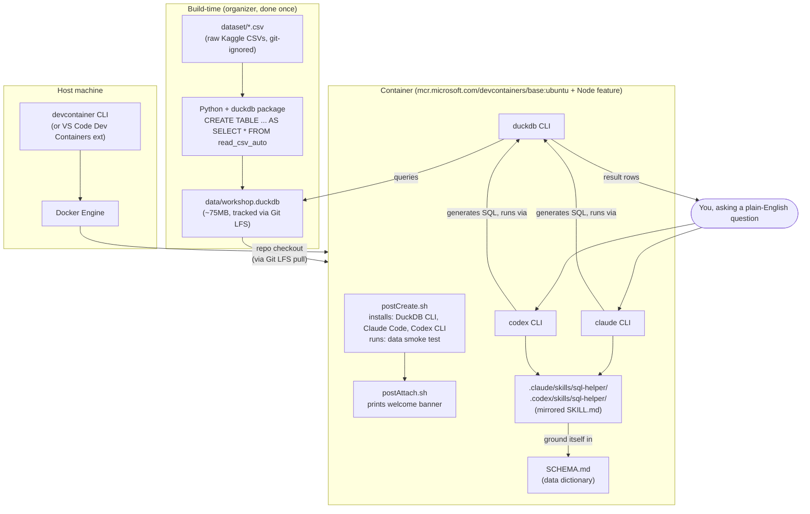

# Iteration 0 — Local Testing

Before touching Codespaces or inviting anyone, run the whole workshop flow on your own machine. This is the organizer's dry run: same container, same data, same skills — just on `localhost` instead of GitHub.

## Architecture

Two separate pipelines: a **build-time** one that only the organizer runs once (already done — see `SCHEMA.md` and `data/workshop.duckdb`), and a **run-time** one that every participant's container reproduces from scratch. Local testing exercises the run-time pipeline only.



**Key points to sanity-check while reviewing:**

- `data/workshop.duckdb` is built once, outside the container, and shipped via Git LFS — the container never regenerates it, it only reads it. If LFS didn't pull, `postCreate.sh`'s smoke test catches that (see `FACILITATOR_TROUBLESHOOTING.md`).
- The container has no direct dependency on `dataset/*.csv` — those are git-ignored and irrelevant at run time. Only `data/workshop.duckdb` and the repo's markdown/skill files matter once the container is up.
- `claude` and `codex` don't talk to `data/workshop.duckdb` directly — they shell out to the `duckdb` CLI, using instructions from `SKILL.md` (grounded in `SCHEMA.md`) to decide what SQL to write and what house rules to follow.
- `.claude/skills/` and `.codex/skills/` are kept in sync by mirroring the same `SKILL.md` (currently via a symlink for the worked example) so both CLIs behave identically — worth confirming this still holds for any new skill you add via `templates/skill-template/`.
- Locally, `devcontainer up` stands in for the "Docker Engine" GitHub runs behind the scenes for a real Codespace — everything from `postCreateCommand` down is identical; only the machine underneath and the OAuth network path differ (see Step 6's caveat).

## Prerequisites

- Docker installed and running (`docker --version`).
- Node.js + npm (`node --version`, `npm --version`) — needed for the `devcontainer` CLI.
- `data/workshop.duckdb` present locally (see [Step 1](#step-1-confirm-the-data-is-there)).

## Step 1 — Confirm the data is there

```bash
ls -la data/workshop.duckdb
```

You should see a ~75MB file. If it's missing, rebuild it from the CSVs in `dataset/` per Part 0 of `WORKSHOP_SETUP_PLAN.md`.

> **Known gap:** this file is meant to be tracked with Git LFS (see `.gitattributes` / Part 1 of the plan), so participants pull it automatically when they open a Codespace. LFS setup is still in progress on this machine — until it's done, `data/workshop.duckdb` is untracked locally and won't be pushed with `git add`/`git commit`. Don't push large-file changes until that's confirmed working (`git lfs version` should succeed).

## Step 2 — Sanity-check the data with DuckDB directly

No container needed for this part — just confirm the file itself is valid before you wrap a devcontainer around it.

```bash
python3 -c "import duckdb; print(duckdb.connect('data/workshop.duckdb').sql('SELECT count(*) FROM transactions').fetchall())"
```

Expect `[(2000000,)]`. If you have the `duckdb` CLI installed, `duckdb data/workshop.duckdb -c "SELECT count(*) FROM transactions;"` does the same thing.

## Step 3 — Install the devcontainer CLI

This lets you build and run the exact container Codespaces will use, locally, via Docker.

```bash
npm install -g @devcontainers/cli
devcontainer --version
```

## Step 4 — Build and start the container

From the repo root:

```bash
devcontainer up --workspace-folder .
```

This builds the image, runs `postCreateCommand` (`.devcontainer/postCreate.sh` — installs DuckDB CLI, Claude Code, Codex CLI, and runs the data smoke test), and reports success or failure. Watch the output for the smoke test lines near the end — it should fail loudly if `data/workshop.duckdb` is missing or the row count looks wrong.

If this step fails, fix it here before ever opening a real Codespace — a broken `postCreateCommand` will fail identically (and more visibly) for every participant.

> **After editing `postCreate.sh` and retrying:** plain `devcontainer up` reuses the existing container and only re-runs `postAttachCommand`, *not* `postCreateCommand` — so it won't actually re-test your fix. Force a clean rebuild instead:
> ```bash
> devcontainer up --workspace-folder . --remove-existing-container
> ```

## Step 5 — Shell into the running container

```bash
devcontainer exec --workspace-folder . bash
```

You're now inside the same environment a participant gets. From here:

```bash
duckdb data/workshop.duckdb -c "SELECT count(*) FROM transactions;"
claude --version
codex --version
```

## Step 6 — Authenticate the CLIs

Still inside the container:

```bash
claude
codex
```

Follow the OAuth prompts (or set an API key per the README's "Before you arrive" section). This is the step most likely to behave differently than a fresh Codespace — port forwarding and browser redirects work differently locally, so don't treat a smooth local login as full proof it'll work in Codespaces. Do a real Codespaces dry run too (see `DAY_OF_CHECKLIST.md`).

## Step 7 — Test the worked-example skill

Ask a question that should trigger `.claude/skills/sql-helper/SKILL.md` (or the Codex mirror):

```
What were the top 5 transaction categories by total amount last quarter?
```

Confirm the model reads `SCHEMA.md`, shows its SQL, and applies the house rules (LIMIT 100 on raw rows, rounded currency, etc.) before trusting the skill for the live workshop.

## Step 8 — Work through `exercises.md`

Run through all 8 example questions yourself. If any answer looks wrong or the model invents a column name, fix `SKILL.md` or `SCHEMA.md` now — not during the workshop.

## Step 9 — Build a throwaway skill from the template

Copy `templates/skill-template/SKILL.md` into a scratch folder, fill in one or two house rules, and confirm it changes model behavior as expected. This is exactly what participants will do in Step 4 of `exercises.md` — if it's confusing for you, it'll be confusing for them.

## Step 10 — Tear down

```bash
devcontainer down --workspace-folder .
```

Or just `docker ps` / `docker rm -f <container>` if `down` isn't available in your CLI version.

## When this all passes

Move on to the real dry run in `DAY_OF_CHECKLIST.md` — a fresh Codespace created exactly as a participant would, timed end-to-end. Local testing catches broken scripts and bad skill logic; only a real Codespace catches Codespaces-specific issues (prebuilds, OAuth redirects, LFS pulls, spending limits).
