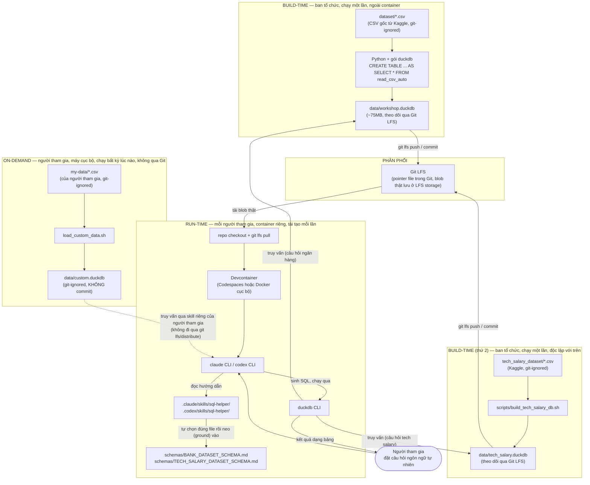
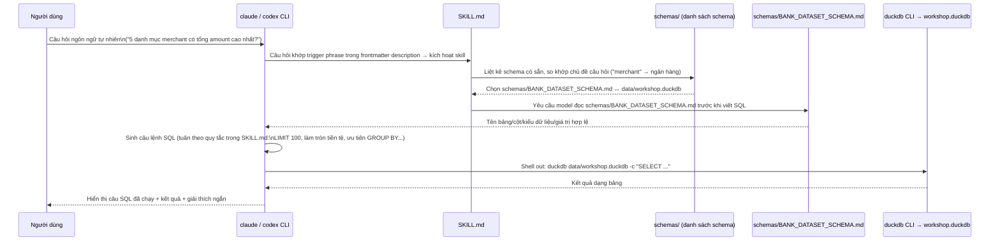
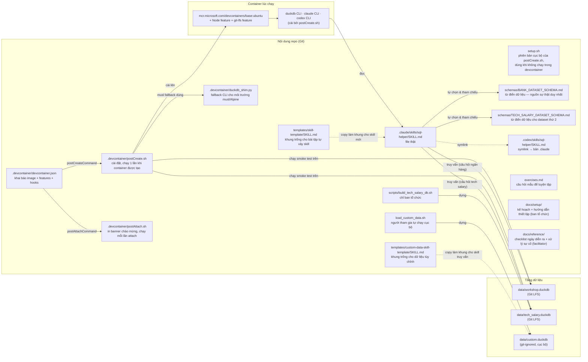

# Kiến Trúc Hệ Thống

Tài liệu này dành cho các kỹ sư (techies) muốn hiểu cách repo này vận hành ở mức hệ thống — không phải hướng dẫn từng bước để chạy workshop (xem `../setup/`) hay checklist vận hành (xem `../reference/`). Nó mô tả các thành phần, luồng dữ liệu, và các quyết định thiết kế đứng sau chúng.

## Tóm tắt

Repo này **không phải là một ứng dụng** — không có build step, không có test suite, không có server chạy liên tục. Nó là:

1. Hai **cơ sở dữ liệu DuckDB đã đóng gói sẵn**, độc lập với nhau: `data/workshop.duckdb` (ngân hàng, ~5.87 triệu dòng / 10 bảng) và `data/tech_salary.duckdb` (tech salary, dùng cho bài tập mở rộng tùy chọn) — cả hai phân phối qua Git LFS. Cộng thêm một database thứ ba, `data/custom.duckdb`, do chính người tham gia tự dựng cục bộ từ CSV của họ (không qua Git LFS, không commit — xem "Đường nạp dữ liệu tùy chỉnh cục bộ" bên dưới).
2. Một **môi trường devcontainer** tái tạo được (Codespaces hoặc Docker cục bộ) cài sẵn DuckDB CLI, Claude Code CLI, và Codex CLI.
3. Một **cặp Skill mẫu** (`.claude/skills/sql-helper/`, mirror sang `.codex/skills/sql-helper/`) hướng dẫn model chuyển câu hỏi ngôn ngữ tự nhiên thành SQL. Skill này **không gắn cứng với một dataset** — nó tự xác định câu hỏi thuộc database nào rồi mới neo vào đúng từ điển dữ liệu tương ứng trong `schemas/` làm nguồn sự thật duy nhất (xem "Vòng đời một câu truy vấn").
4. Bộ tài liệu Markdown làm "chất keo" — dữ liệu thô + hướng dẫn agent + tài liệu hướng dẫn con người, không có tầng logic ứng dụng nào ở giữa.

Nói cách khác: **model chính là runtime**. Không có backend, không có API, không có ORM — CLI của Claude Code / Codex đọc `SKILL.md`, tự viết SQL, và shell ra `duckdb` CLI để chạy nó trực tiếp trên file `.duckdb` cục bộ.

## Hai pipeline: build-time và run-time

Có một ranh giới rõ ràng giữa việc *chuẩn bị* dữ liệu (làm một lần, bởi ban tổ chức) và việc *dùng* dữ liệu (làm lại mỗi lần, bởi mỗi người tham gia / mỗi Codespace).

**Vì sao tách ra như vậy:**
- Build-time chỉ chạy **một lần** vì dữ liệu tĩnh — không có ingest pipeline sống, không có cron job cập nhật dữ liệu. Có hai pipeline build-time độc lập (ngân hàng, tech-salary) vì đây là hai dataset không liên quan, không có kỳ vọng join xuyên dataset nào.
- Run-time phải **tái tạo được hoàn toàn từ đầu** với chi phí thấp, vì nó chạy 20–50 lần song song (mỗi người tham gia một Codespace) trong nửa ngày.
- Container không bao giờ tự dựng lại `data/workshop.duckdb`/`data/tech_salary.duckdb` — nó chỉ đọc file đã build sẵn. Điều này giữ cho `postCreateCommand` nhanh (vài chục giây, không phải vài phút) và loại bỏ khả năng mỗi Codespace nạp dữ liệu khác nhau.
- Đường **on-demand** (dữ liệu tùy chỉnh cục bộ) khác về bản chất với hai đường build-time ở trên: nó không chạy một lần bởi ban tổ chức, mà chạy lại **bất kỳ lúc nào** bởi chính người tham gia, trên máy của họ, và kết quả (`data/custom.duckdb`) không bao giờ đi qua Git/Git LFS — luôn git-ignored, không commit.

## Vòng đời một câu truy vấn

Đây là những gì thực sự xảy ra khi một người tham gia gõ một câu hỏi ngôn ngữ tự nhiên vào `claude` hoặc `codex`:

**Điểm mấu chốt về mặt kiến trúc:** `claude`/`codex` **không** có kết nối trực tiếp, có trạng thái (stateful connection) tới DuckDB. Mỗi truy vấn là một lời gọi CLI độc lập, không giữ session — không có connection pooling, không có transaction xuyên nhiều lượt hỏi. Điều này giữ cho mô hình bảo mật đơn giản (không có gì để rò rỉ ngoài chính file `.duckdb`) nhưng cũng có nghĩa là **mọi ràng buộc về tính đúng đắn của SQL sinh ra đều nằm ở tầng prompt** (`SKILL.md`), không có tầng validate ở giữa.

## Bản đồ thành phần

## Hai đường chạy container: Codespaces và cục bộ

`devcontainer.json` là nguồn cấu hình **duy nhất** cho cả hai đường chạy — không có config riêng cho local. Sự khác biệt chỉ nằm ở nơi Docker Engine chạy và cách OAuth redirect hoạt động.

| | GitHub Codespaces | Devcontainer cục bộ |
|---|---|---|
| Docker Engine | Do GitHub host | Docker Desktop / Engine trên máy bạn |
| Kích hoạt | `codespaces.new/...` hoặc nút "Open in Codespaces" | `devcontainer up --workspace-folder .` (CLI `@devcontainers/cli`) |
| `postCreateCommand` / `postAttachCommand` | Giống hệt | Giống hệt |
| Git LFS pull | Tự động qua GitHub token có sẵn | `git lfs pull` cần credentials cục bộ |
| OAuth redirect (đăng nhập `claude`/`codex`) | Qua port forwarding của Codespaces | Qua `localhost` trực tiếp |
| Bộ dữ liệu thứ hai (`data/tech_salary.duckdb`) | Preload tự động (cùng `git lfs pull`), smoke test riêng trong `postCreate.sh` | Preload tự động qua `setup.sh` (mirror smoke test) |
| Dùng để | Trải nghiệm thật của người tham gia | Chạy thử của ban tổ chức trước ngày diễn ra (xem `../setup/Iteration_0_LocalTesting.md`) |

`setup.sh` (ở gốc repo) là một đường thứ ba — dùng khi ai đó muốn chạy workshop **ngoài** devcontainer hoàn toàn (máy cá nhân, không Docker). Nó lặp lại đúng các bước của `postCreate.sh` (cài DuckDB/Claude/Codex CLI, `git lfs pull`, smoke test cho cả hai database) nhưng chạy trực tiếp trên máy host thay vì trong container, và có thêm các bước kiểm tra prerequisite (`git`, `curl`, `node`, `git-lfs`) mà devcontainer đã đảm bảo sẵn qua base image — nếu thiếu, script chỉ báo lỗi kèm hướng dẫn cài thủ công, không tự cài (xem "Cài đặt cục bộ là tài liệu + trợ lý kỹ thuật" bên dưới).

## Các quyết định thiết kế đáng chú ý

- **Phân phối dữ liệu qua Git LFS, không qua ingest pipeline sống.** Dataset tĩnh (bản chụp một lần từ Kaggle), nên build một lần rồi ship binary `.duckdb` là đơn giản hơn nhiều so với để mỗi container tự chạy lại `read_csv_auto` trên ~6 triệu dòng CSV lúc khởi động.
- **Mỗi file trong `schemas/` là nguồn sự thật duy nhất cho một database, không phải introspection runtime.** Skill được hướng dẫn đọc file Markdown tĩnh thay vì tự chạy `DESCRIBE`/`PRAGMA` để khám phá schema — giữ cho hành vi model có thể dự đoán được và cho phép ban tổ chức kiểm soát chính xác những gì model "biết" về dữ liệu (bao gồm cả các ghi chú/điểm đặc biệt trong phần "Lưu ý & điểm đặc biệt"). Mỗi file mở đầu bằng dòng "File cơ sở dữ liệu: `data/....duckdb`" nêu rõ nó ứng với database nào — `sql-helper` đọc dòng này để tự ánh xạ schema ↔ database thay vì hardcode danh sách, nên thêm dataset thứ ba chỉ cần thêm một file vào `schemas/`, không cần sửa skill.
- **`.codex/skills/sql-helper/SKILL.md` là symlink, không phải bản copy.** Đảm bảo Claude Code và Codex CLI luôn nhận đúng cùng một bộ hướng dẫn — sửa một nơi (`.claude/`), cả hai CLI cùng cập nhật. Rủi ro đánh đổi: symlink không luôn được các công cụ Windows/zip xử lý đúng, nên `postCreate.sh`/tài liệu setup có bước xác minh cho việc này.
- **Fallback musl/Alpine cho DuckDB CLI (`duckdb_shim.py`).** Binary CLI chính thức của DuckDB liên kết với glibc và không chạy trên musl. Thay vì yêu cầu mọi môi trường phải là glibc, `postCreate.sh` phát hiện Alpine và cài gói Python `duckdb` (có sẵn musllinux wheel) đứng sau một shim script mô phỏng interface CLI (`duckdb <db> -c "<SQL>"`, `-csv`, `-json`, `-noheader`, stdin). Bất kỳ thay đổi nào về cách workshop gọi CLI `duckdb` đều phải giữ tương thích với tập flag mà shim này hỗ trợ.
- **Không có tầng validate SQL giữa model và DuckDB.** Model shell trực tiếp ra `duckdb` CLI với câu SQL nó tự sinh — không có allowlist câu lệnh, không có read-only enforcement ở tầng ứng dụng. An toàn dữ liệu dựa vào: (a) dataset là bản sao tổng hợp/không nhạy cảm, (b) mỗi người tham gia chỉ có quyền trên container/file của chính họ, và (c) các quy tắc trong `SKILL.md` (ví dụ ưu tiên `SELECT`/tổng hợp) là hướng dẫn hành vi cho model, không phải rào chắn kỹ thuật.
- **Container tách biệt hoàn toàn khỏi `dataset/*.csv`.** File CSV gốc bị git-ignore và không tồn tại trong container lúc chạy — chỉ `data/workshop.duckdb` (đã build sẵn) mới quan trọng ở run-time. Điều này giữ cho kích thước container nhỏ và loại bỏ phụ thuộc vào toolchain build (Python + `duckdb` package) ở phía người tham gia.
- **Hai file `.duckdb` độc lập cho hai dataset, không gộp chung schema.** `data/workshop.duckdb` và `data/tech_salary.duckdb` không có join xuyên dataset nào được kỳ vọng — giữ mô hình tinh thần đơn giản (mỗi dataset một file, một từ điển dữ liệu riêng) và loại bỏ hoàn toàn rủi ro đụng tên bảng/cột giữa hai domain không liên quan.
- **`sql-helper` (skill mẫu) là một skill hợp nhất, tự định tuyến, không phải một skill gắn cứng với một dataset.** Thay vì có một skill mẫu riêng cho ngân hàng, skill mẫu tự xác định database phù hợp với câu hỏi (quét `schemas/`, so khớp chủ đề) rồi mới neo vào đúng từ điển dữ liệu — người tham gia thấy pattern này ngay từ Bước 1, trước khi tự viết skill của mình. Đây là lựa chọn có cân nhắc — cách gắn cứng một dataset đơn giản hơn để đọc lúc mới học, nhưng một skill tự định tuyến là ví dụ trung thực hơn cho việc skill sẽ cần mở rộng ra sao khi có nhiều nguồn dữ liệu. Kỹ thuật chọn database cụ thể (so khớp từ khóa, đọc dòng "File cơ sở dữ liệu" đầu mỗi schema) được viết tường minh trong `SKILL.md` chứ không phải introspect runtime.
- **Bài tập mở rộng (Bước 7) có người tham gia tự tay thêm lại đúng pattern định tuyến đó vào skill của chính họ.** Skill họ xây ở Bước 4 (từ `templates/skill-template/SKILL.md`) cố tình chỉ gắn với một dataset (ngân hàng) — Bước 7 yêu cầu họ mở rộng nó để tự "ground" vào cả hai từ điển dữ liệu và tự chọn đúng database theo câu hỏi, y hệt những gì `sql-helper` đã làm mẫu. Kỹ thuật cụ thể (nhiều lệnh `duckdb` riêng hay `ATTACH`) cố tình không được quy định trước trong bài tập, dù `sql-helper` đã chọn sẵn cách "hai lệnh `duckdb` riêng" làm ví dụ tham khảo.
- **Cài đặt cục bộ là tài liệu + trợ lý kỹ thuật, không phải installer tự động.** Không có `setup.ps1` hay bước tự cài Homebrew/apt-get nào trong `setup.sh` — có một trợ lý kỹ thuật hỗ trợ trực tiếp người tham gia cài đặt cục bộ, nên đầu tư vào một hướng dẫn thủ công chính xác (`../setup/WORKSHOP_SETUP_GUIDE_LOCAL.md` Phần 0b/9 + `../reference/FACILITATOR_TROUBLESHOOTING.md`) mang lại giá trị cao hơn so với rủi ro/chi phí bảo trì một installer đa nền tảng không người giám sát.
- **Dữ liệu tùy chỉnh cục bộ chỉ hỗ trợ CSV.** Excel/.xlsx bị loại khỏi phạm vi `load_custom_data.sh` một cách có chủ đích — việc đó được xử lý bởi một sản phẩm riêng (Claude for Excel), giới thiệu qua trình bày/demo, không xây lại trong repo này.
- **Không có từ điển dữ liệu tự động sinh cho dữ liệu tùy chỉnh.** Khác với `schemas/BANK_DATASET_SCHEMA.md`/`schemas/TECH_SALARY_DATASET_SCHEMA.md` (do ban tổ chức viết trước), người tham gia tự khám phá schema dữ liệu của chính họ (`.tables`, `DESCRIBE`) và tự viết vào `SKILL.md` — một phần cố ý của bài tập, không phải tính năng còn thiếu.

## Bản đồ tài liệu liên quan

- `../setup/WORKSHOP_SETUP_PLAN.md` — vì sao các quyết định thiết kế ở trên được đưa ra, dưới góc nhìn tổ chức workshop.
- `../setup/WORKSHOP_SETUP_GUIDE_LOCAL.md`, `../setup/WORKSHOP_SETUP_GUIDE_CODESPACES.md` — checklist xác minh dry-run cho hai đường chạy container.
- `../setup/Iteration_0_LocalTesting.md` — kiểm thử toàn bộ luồng run-time cục bộ trước khi mời người tham gia.
- `../reference/DAY_OF_CHECKLIST.md`, `../reference/FACILITATOR_TROUBLESHOOTING.md` — vận hành thực tế trong ngày diễn ra, bao gồm mục "Hỗ trợ cài đặt cục bộ" cho trợ lý kỹ thuật.
- `../../schemas/BANK_DATASET_SCHEMA.md` — từ điển dữ liệu ngân hàng đầy đủ (10 bảng).
- `../../schemas/TECH_SALARY_DATASET_SCHEMA.md` — từ điển dữ liệu cho dataset thứ hai (Tech Salary).
- `../../scripts/build_tech_salary_db.sh` — công cụ nội bộ ban tổ chức dựng `data/tech_salary.duckdb`.
- `../../load_custom_data.sh`, `../../templates/custom-data-skill-template/SKILL.md` — luồng dữ liệu tùy chỉnh cục bộ (tùy chọn, chỉ CSV).
- `../../CLAUDE.md` — hướng dẫn dành cho Claude Code khi làm việc trong repo này (tiếng Anh, không dịch).
