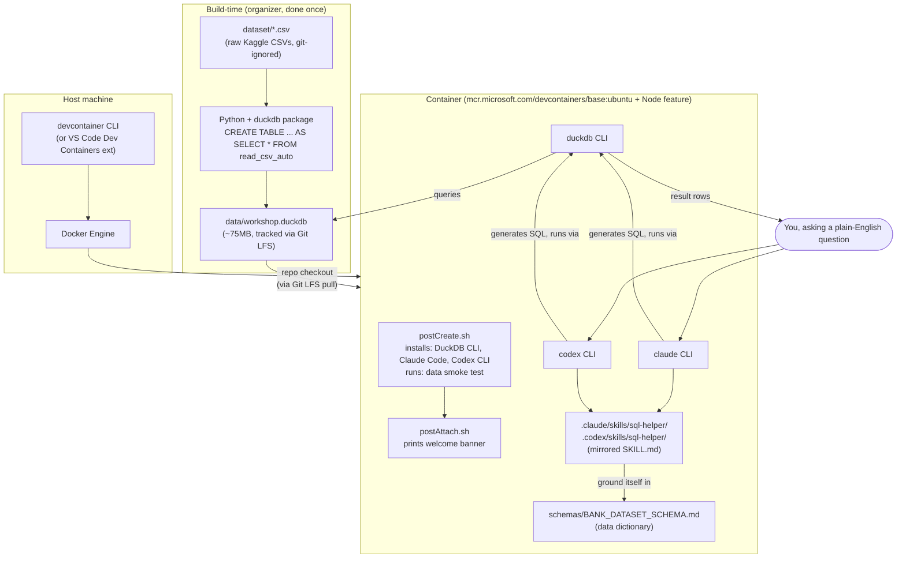

# Iteration 0 — Kiểm Thử Cục Bộ

Trước khi động đến Codespaces hay mời bất kỳ ai, hãy chạy toàn bộ luồng workshop trên máy của chính bạn. Đây là bước chạy thử của ban tổ chức: cùng container, cùng dữ liệu, cùng skill — chỉ khác là chạy trên `localhost` thay vì GitHub.

## Kiến trúc

Có hai pipeline riêng biệt: một pipeline **build-time** mà chỉ ban tổ chức chạy một lần (đã hoàn tất — xem `schemas/BANK_DATASET_SCHEMA.md` và `data/workshop.duckdb`), và một pipeline **run-time** mà container của mỗi người tham gia tái tạo lại từ đầu. Kiểm thử cục bộ chỉ thực hiện pipeline run-time.



**Các điểm cần rà soát kỹ khi xem lại:**

- `data/workshop.duckdb` được build một lần, bên ngoài container, và được vận chuyển qua Git LFS — container không bao giờ tự tạo lại nó, chỉ đọc nó. Nếu LFS không pull được, smoke test của `postCreate.sh` sẽ bắt được điều này (xem `../reference/FACILITATOR_TROUBLESHOOTING.md`).
- Container không phụ thuộc trực tiếp vào `dataset/*.csv` — các file đó bị git-ignore và không liên quan ở run time. Chỉ `data/workshop.duckdb` và các file markdown/skill của repo mới quan trọng khi container đã chạy.
- `claude` và `codex` không nói chuyện trực tiếp với `data/workshop.duckdb` — chúng shell out sang CLI `duckdb`, dùng hướng dẫn từ `SKILL.md` (dựa trên `schemas/BANK_DATASET_SCHEMA.md`) để quyết định viết SQL gì và tuân theo quy tắc nào.
- `.claude/skills/` và `.codex/skills/` được giữ đồng bộ bằng cách mirror cùng một `SKILL.md` (hiện tại qua symlink cho skill mẫu) để cả hai CLI hoạt động giống hệt nhau — đáng để xác nhận điều này vẫn đúng với bất kỳ skill mới nào bạn thêm qua `templates/skill-template/`.
- Ở cục bộ, `devcontainer up` đóng vai trò thay cho "Docker Engine" mà GitHub chạy ngầm cho một Codespace thật — mọi thứ từ `postCreateCommand` trở xuống đều giống hệt nhau; chỉ khác máy chạy bên dưới và đường mạng OAuth (xem lưu ý ở Bước 6).

## Điều kiện tiên quyết

- Docker đã cài đặt và đang chạy (`docker --version`).
- Node.js + npm (`node --version`, `npm --version`) — cần cho CLI `devcontainer`.
- `data/workshop.duckdb` đã có sẵn cục bộ (xem [Bước 1](#bước-1--xác-nhận-dữ-liệu-đã-có-sẵn)).

## Bước 1 — Xác nhận dữ liệu đã có sẵn

```bash
ls -la data/workshop.duckdb
```

Bạn sẽ thấy một file khoảng 75MB. Nếu bị thiếu, hãy build lại từ các file CSV trong `dataset/` theo Phần 0 của `WORKSHOP_SETUP_PLAN.md`.

> **Khoảng trống đã biết:** file này lẽ ra được theo dõi bằng Git LFS (xem `.gitattributes` / Phần 1 của kế hoạch), để người tham gia tự động pull khi mở Codespace. Việc thiết lập LFS vẫn đang trong quá trình thực hiện trên máy này — cho đến khi hoàn tất, `data/workshop.duckdb` chưa được track cục bộ và sẽ không được push cùng `git add`/`git commit`. Đừng push các thay đổi file lớn cho đến khi xác nhận điều này hoạt động (`git lfs version` phải chạy thành công).

## Bước 2 — Kiểm tra nhanh dữ liệu trực tiếp bằng DuckDB

Không cần container cho phần này — chỉ cần xác nhận bản thân file hợp lệ trước khi bọc nó trong một devcontainer.

```bash
python3 -c "import duckdb; print(duckdb.connect('data/workshop.duckdb').sql('SELECT count(*) FROM transactions').fetchall())"
```

Kết quả mong đợi là `[(2000000,)]`. Nếu bạn đã cài CLI `duckdb`, lệnh `duckdb data/workshop.duckdb -c "SELECT count(*) FROM transactions;"` cũng cho kết quả tương tự.

## Bước 3 — Cài đặt CLI devcontainer

Việc này cho phép bạn build và chạy chính xác container mà Codespaces sẽ dùng, ở cục bộ, thông qua Docker.

```bash
npm install -g @devcontainers/cli
devcontainer --version
```

## Bước 4 — Build và khởi động container

Từ thư mục gốc của repo:

```bash
devcontainer up --workspace-folder .
```

Lệnh này build image, chạy `postCreateCommand` (`.devcontainer/postCreate.sh` — cài DuckDB CLI, Claude Code, Codex CLI, và chạy smoke test dữ liệu), rồi báo cáo thành công hay thất bại. Theo dõi output để tìm các dòng smoke test gần cuối — nó phải báo lỗi rõ ràng nếu `data/workshop.duckdb` bị thiếu hoặc số dòng có vẻ sai.

Nếu bước này thất bại, hãy sửa ngay ở đây trước khi mở một Codespace thật — một `postCreateCommand` bị hỏng sẽ thất bại y hệt (và rõ ràng hơn) với mọi người tham gia.

> **Sau khi sửa `postCreate.sh` và thử lại:** lệnh `devcontainer up` thông thường tái sử dụng container đã có và chỉ chạy lại `postAttachCommand`, *không* chạy lại `postCreateCommand` — vì vậy nó sẽ không thực sự kiểm tra lại bản sửa của bạn. Thay vào đó, hãy ép build lại từ đầu:
> ```bash
> devcontainer up --workspace-folder . --remove-existing-container
> ```

## Bước 5 — Shell vào container đang chạy

```bash
devcontainer exec --workspace-folder . bash
```

Giờ bạn đang ở trong đúng môi trường mà một người tham gia sẽ nhận được. Từ đây:

```bash
duckdb data/workshop.duckdb -c "SELECT count(*) FROM transactions;"
claude --version
codex --version
```

## Bước 6 — Xác thực các CLI

Vẫn đang ở trong container:

```bash
claude
codex
```

Làm theo các bước OAuth (hoặc đặt một API key theo hướng dẫn ở phần "Before you arrive" của README). Đây là bước có khả năng cao nhất sẽ hoạt động khác so với một Codespace mới — port forwarding và redirect trình duyệt hoạt động khác nhau khi chạy cục bộ, vì vậy đừng xem việc đăng nhập cục bộ trơn tru là bằng chứng đầy đủ rằng nó sẽ hoạt động trên Codespaces. Hãy thực hiện thêm một lần chạy thử Codespaces thật (xem `../reference/DAY_OF_CHECKLIST.md`).

## Bước 7 — Kiểm thử skill mẫu

Đặt một câu hỏi để kích hoạt `.claude/skills/sql-helper/SKILL.md` (hoặc bản mirror của Codex):

```
What were the top 5 transaction categories by total amount last quarter?
```

Xác nhận model đọc `schemas/BANK_DATASET_SCHEMA.md`, hiển thị câu SQL đã chạy, và áp dụng các quy tắc trong `SKILL.md` (LIMIT 100 trên raw rows, làm tròn tiền tệ, v.v.) trước khi tin dùng skill này cho buổi workshop thật.

## Bước 8 — Làm qua `exercises.md`

Tự chạy qua cả 8 câu hỏi mẫu. Nếu câu trả lời nào có vẻ sai hoặc model bịa ra tên cột, hãy sửa `SKILL.md` hoặc `schemas/BANK_DATASET_SCHEMA.md` ngay bây giờ — không phải trong lúc workshop.

## Bước 9 — Xây một skill dùng thử từ template

Sao chép `templates/skill-template/SKILL.md` vào một thư mục nháp, điền vào một hoặc hai quy tắc, và xác nhận nó thay đổi hành vi của model đúng như mong đợi. Đây chính xác là điều người tham gia sẽ làm ở Bước 4 của `exercises.md` — nếu nó gây khó hiểu cho bạn, nó sẽ gây khó hiểu cho họ.

## Bước 10 — Dọn dẹp

```bash
devcontainer down --workspace-folder .
```

Hoặc chỉ cần `docker ps` / `docker rm -f <container>` nếu `down` không khả dụng trong phiên bản CLI của bạn.

## Khi tất cả đều đạt

Chuyển sang bước chạy thử thật trong `../reference/DAY_OF_CHECKLIST.md` — một Codespace mới được tạo đúng như một người tham gia sẽ làm, đo thời gian từ đầu đến cuối. Kiểm thử cục bộ bắt được các script hỏng và logic skill sai; chỉ một Codespace thật mới bắt được các vấn đề đặc thù của Codespaces (prebuild, redirect OAuth, LFS pull, giới hạn chi tiêu).
